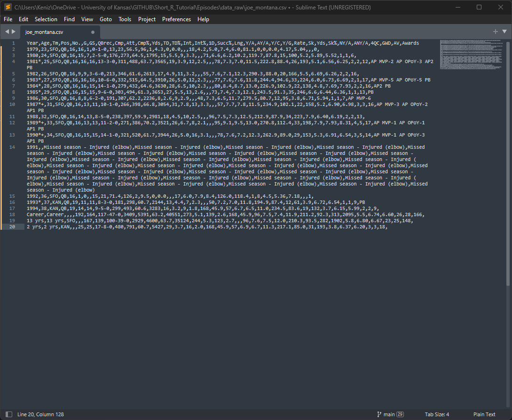

```{r, echo=FALSE, purl=FALSE, message=FALSE}
source("setup.R")
```

------------------------------------------------------------------------

::: objectives
### Exercise objectives

We have learned the basics for working with R and Rstudio. Now lets attempt to put the pieces together. I would like for everyone to navigate to [sports-reference](https://www.sports-reference.com/) and select a professional sport, from here select a single player and download a .csv file of their career stats.

#### Key Steps

-   Download or copy .csv formatted career stats for a single player
-   Import data into R (remember we learned how to use the read.csv() function)
-   Tidy the data as needed, rows for years and columns for individual performance stats
-   Generate a plot for single stat across the age of the player (e.g. home runs by player age)
-   Generate a plot for single stat across the teams the player has played on

#### Bonus

-   Can you figure out how to combine the plots into a single plot? We did not cover this but a hint is to look at the help page for ggarrange() a function from the ggpubr package.
:::

------------------------------------------------------------------------

## Downloading our data

We can see we have four choices of sports, pick the one is of most interest to you and select a single player to view their career stats.

```{r, out.width="75%", results="show", echo=FALSE, fig.alt="Sports reference homepage with seperate sections for baseball, basketball, football, and hockey"}

```

Select the **Share & Export** button on the website and select the **Get table as CSV (for Excel)** option.

```{r, out.width="75%", results="show", echo=FALSE, fig.alt="Sports reference webpage of Joe Montana's career stats"}

```

Copy this information into a new text document and save as ***Player-First-Name***_***Player-Last-Name***.csv in the data_raw folder we created earlier.

```{r, out.width="75%", results="show", echo=FALSE, fig.alt="Sports reference data for Joe Montana in csv format"}

```

```{r, out.width="75%", results="show", echo=FALSE, fig.alt="Sports reference data for Joe Montana in csv format open in sublime text editor"}

```


## Data Import and Wrangling

Lets start by loading a packages we will need (e.g. the **`tidyverse`** package).

```{r load-package, message=FALSE, purl=FALSE}
library(tidyverse)
```

Now we will load our player data, remember the name and format maybe a bit different depending on the sport and player.

```{r load-data, message=FALSE, warning=FALSE,  purl=FALSE}
player_data <- read_csv("data_raw/joe_montana.csv")
```

```{r, results="show", echo= FALSE, purl=FALSE}
kableExtra::kable(player_data) %>%
  kableExtra::kable_styling("striped", full_width = F) %>%
  kableExtra::scroll_box(width = "100%", height = "200px")
```

We can see there are several issues that need to be correct for our data frame containing stats per season for Joe Montana. Lets work through how to fix them using what we learned about indexing data frames.

First we will remove the few rows that do not contain data we want. 

- One is a season that was missed due to injury (1991).
- Three columns at the end that have career and composite stats (2 year and 13 year combine data).

We can easily remove the first column by checking whether ***Age*** is **NA** and removing columns that meet this criteria.The other columns come at the end of the data frame so we can use indexing to remove he last three rows.

```{r, results="show", purl=FALSE}
player_data$Age
player_data <- player_data[!is.na(player_data$Age), ]
player_data_clean <- player_data[-c(16,17,18),]
```

```{r, results="show", echo= FALSE, purl=FALSE}
kableExtra::kable(player_data_clean) %>%
  kableExtra::kable_styling("striped", full_width = F) %>%
  kableExtra::scroll_box(width = "100%", height = "200px")
```

### Converting columns to factors/numeric

To facilitate easier plotting in ggplot, we need to convert some of the columns in the data frame to factors. We can use **`str()`** or **`summary()`** to view the current state of the data frame. You will likely need to do things a bit differently depending on what sport/player you selected. Try to work through the process of converting the team and age to a factor and two stats to numeric.
```{r, results="show", purl=FALSE}
str(player_data_clean, list.len = 12)

# Convert team and age to factors
player_data_clean$Tm <- as.factor(player_data_clean$Tm)
player_data_clean$Age <- as.factor(player_data_clean$Age)
# Convert TD and yards to numeric
player_data_clean$TD <- as.numeric(player_data_clean$TD)
# We need to first rename the passing yards column to something more understandable
names(player_data_clean)[names(player_data_clean) == 'Yds...12'] <- 'Passing_Yds'
player_data_clean$Passing_Yds <- as.numeric(player_data_clean$Passing_Yds)
```

## Plotting

Lets start by thinking about what kind of plot might make sense for the type of data we have. Check back to the [ggplot cheat sheet](https://rstudio.github.io/cheatsheets/data-visualization.pdf)!

### Touchdowns by team

```{r, results="show", purl=FALSE}
ggplot(data = player_data_clean, aes(x = Tm, y = TD)) +
  geom_col()
```

#### Can we jazz it up a bit?

```{r, results="show", purl=FALSE}
ggplot(data = player_data_clean, aes(x = Tm, y = TD, fill = Tm)) +
  geom_col() +
  xlab("Team") +
  ylab("Touchdowns") +
  scale_fill_manual(name = "Team", values = c("#E31837","#AA0000")) + # Team colors found on google
  theme_bw()
```


### Passing Yards by age

```{r, results="show", purl=FALSE}
ggplot(data = player_data_clean, aes(x = Age, y = Passing_Yds)) +
  geom_col()

# And the jazzed version
ggplot(data = player_data_clean, aes(x = Age, y = Passing_Yds, fill = Tm)) +
  geom_col() +
  xlab("Age") +
  ylab("Passing Yards") +
  scale_fill_manual(name = "Team", values = c("#E31837","#AA0000")) + # Team colors found on google
  theme_bw()
```


#### Extra plot, Touchdowns by Games started with a trend line

```{r, results="show", purl=FALSE}
ggplot(data = player_data_clean, aes(x = as.numeric(GS), y = TD, fill = Tm)) +
  geom_point(shape = 21, size = 5) +
  xlab("Games Started") +
  ylab("Touchdowns") +
  scale_fill_manual(name = "Team", values = c("#E31837","#AA0000")) + # Team colors found on google
  theme_bw()

# Can we add a linear regression line for the relationship?
ggplot(data = player_data_clean, aes(x = as.numeric(GS), y = TD)) +
  geom_point(shape = 21, fill = "green", size = 5) +
  geom_smooth(method = lm) +
  xlab("Games Started") +
  ylab("Touchdowns") +
  theme_bw()

```


### Bonus: Combining plots together

Often in a manuscript we would like to have multiple panels to a figure denoted by letters. We can utilize the package [`ggpubr`](https://cran.r-project.org/web/packages/ggpubr/index.html), note there are many other great packages for working with multiple plots (e.g. [`patchwork`](https://cran.r-project.org/web/packages/patchwork/index.html))


We first must save our plots to objects.
```{r}

plot_1 <- ggplot(data = player_data_clean, aes(x = Age, y = Passing_Yds, fill = Tm)) +
  geom_col() +
  xlab("Age") +
  ylab("Passing Yards") +
  scale_fill_manual(name = "Team", values = c("#E31837","#AA0000")) + # Team colors found on google
  theme_bw()

plot_2 <- ggplot(data = player_data_clean, aes(x = Tm, y = TD, fill = Tm)) +
  geom_col() +
  xlab("Team") +
  ylab("Touchdowns") +
  scale_fill_manual(name = "Team", values = c("#E31837","#AA0000")) + # Team colors found on google
  theme_bw()

```


Next we need to load the **`ggpubr`** package and use the **`ggarrange()`** function. Try to utilize the help page for **`ggarrange()`** to figure out what options to include.
```{r}
library(ggpubr)

# Basic example
ggarrange(plot_1, plot_2)
```

##### Can you get to this plot using  **`ggarrange()`** options?
```{r, echo=FALSE}
# Basic example
ggarrange(plot_1, plot_2, common.legend = TRUE, labels = "AUTO", legend = 'right')
```

